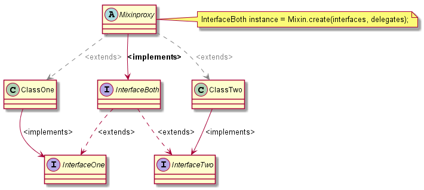

# JavaMixins / Pure Java mixins (and their Spring Framework integration)
## Multiple class inheritance made ease

Did you had ever the problem having a growing interface which implementation 
class is getting larger and larger? I had it in many of my projects and one 
solution which does not require complicated patterns is using mixins. They are 
easy to use proxy which can generate virtual class from single instances. 

You have to refactor your OriginalInterface this way: 

1. Split your OriginalInterface into several single interfaces (InterfaceOne, InterfaceTwo, ...)
2. Create an implementation for each single interface (ClassOne, ClassTwo, ...)
3. Empty OriginalInterface end let it extends all single interfaces from point (2) (InterfaceBoth)
4. Create a Mixin Proxy like shown in this example. (InterfaceBoth iBoth = (InterfaceBoth) Mixin.create(...))

Additionally this example is showing how to do this in a spring environment if you need to inject resources. 

Mixin helper used: http://cglib.sourceforge.net/apidocs/net/sf/cglib/proxy/Mixin.html
